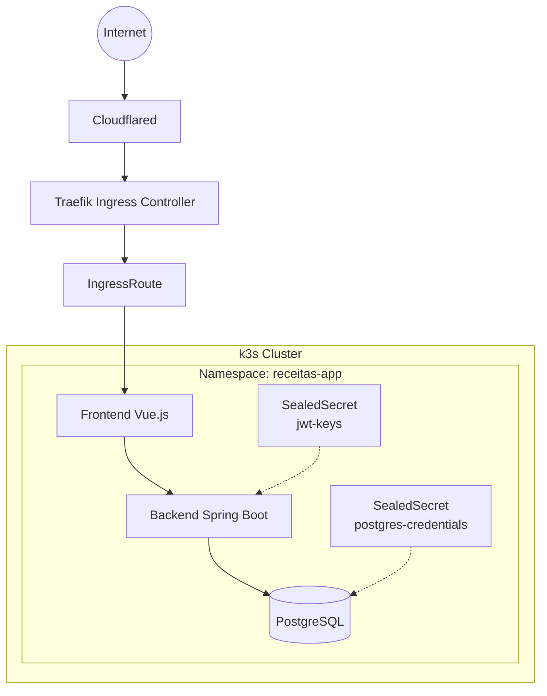

# receitas-app-infra

Repositório GitOps para o **Receitas App** — uma aplicação de receitas composta por um frontend Vue.js, uma API Spring Boot e PostgreSQL, implantada em Kubernetes utilizando ArgoCD.

## Arquitetura



---

# Estrutura do repositório

```text
k8s/
├── app/
│   ├── kustomization.yaml
│   ├── receitas-app.yml
│   ├── deployment.yml
│   ├── frontend.yml
│   ├── ingressroute.yaml
│   ├── ingressroute-backend.yaml
│   ├── middleware.yaml
│   ├── argocd-ingressroute.yaml
│   ├── db/
│   │   └── postgresql.yaml
│   └── security/
│       ├── jwt-sealedsecret.yaml
│       ├── postgres-sealedsecret.yaml
│       └── seal-secrets.sh

```

---

# Componentes

| Componente | Imagem                                                | Porta | Service   |
| ---------- | ----------------------------------------------------- | ----- | --------- |
| Frontend   | `ghcr.io/jaimecabrito01/api-receitas-frontend:latest` | 80    | ClusterIP |
| Backend    | `ghcr.io/jaimecabrito01/api-receitas-backend:latest`  | 8080  | ClusterIP |
| PostgreSQL | `postgres:15-alpine`                                  | 5432  | ClusterIP |

O backend utiliza:

* PostgreSQL
* Chaves JWT montadas em `/etc/jwt`
* Secrets gerenciados via Sealed Secrets

---

# Rotas

| Caminho      | Destino           |
| ------------ | ----------------- |
| `/`          | Frontend          |
| `/api/*`     | Backend           |


---

# Sync Waves

| Wave | Descrição                           |
| ---- | ----------------------------------- |
| -1   | Namespace bootstrap                 |
| 0    | Aplicação, banco, secrets e ingress |

---

# Segurança

O projeto utiliza **Bitnami Sealed Secrets** para armazenar credenciais de forma segura no repositório Git.

Atualmente são utilizados dois secrets:

| Secret                 | Finalidade                           |
| ---------------------- | ------------------------------------ |
| `jwt-keys`             | Par de chaves JWT utilizado pela API |
| `postgres-credentials` | Usuário e senha do PostgreSQL        |

Os arquivos versionados no Git são apenas os **SealedSecrets**, nunca os Secrets em texto plano.

---

# Regenerando os Sealed Secrets

Sempre que necessário, execute:

```bash
./k8s/app/security/seal-secrets.sh
```

O script gera automaticamente os recursos necessários, incluindo:

* par de chaves JWT;
* credenciais do PostgreSQL;
* respectivos manifests `SealedSecret`.

É necessário possuir:

* `kubeseal`
* controlador Sealed Secrets instalado no cluster.

---

# Fluxo GitOps

```text
Desenvolvedor
      │
      ▼
Push no repositório da aplicação
      │
      ▼
GitHub Actions
      │
      ├── Build Frontend
      ├── Build Backend
      └── Push das imagens para GHCR
                    │
                    ▼
Atualização do repositório GitOps
                    │
                    ▼
ArgoCD detecta alterações
                    │
                    ▼
Sincronização automática
                    │
                    ▼
k3s Cluster atualizado
```

Este repositório contém apenas os manifests Kubernetes. As imagens das aplicações são produzidas por um pipeline de CI externo e publicadas no GitHub Container Registry (GHCR).

---

# Tecnologias utilizadas

* Kubernetes (k3s)
* ArgoCD
* Traefik
* Bitnami Sealed Secrets
* Kustomize
* Cloudflared
* GitHub Actions
* GitHub Container Registry (GHCR)

---

# Roadmap

Planejamento da evolução da infraestrutura:

* Provisionamento da infraestrutura utilizando Terraform;
* Monitoramento com Prometheus;
* Dashboards com Grafana;
* Expansão do ambiente GitOps para novos serviços do homelab.
* Pipelines para testes e fluxo de desenvolvimento
