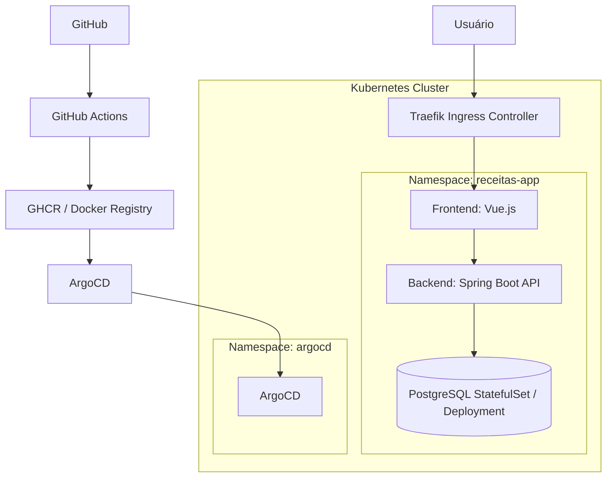

# receitas-app-infra

```mermaid
flowchart TB

USER[Usuário]

GH[GitHub]
GHA[GitHub Actions]
CR[GHCR / Docker Registry]
ARGO[ArgoCD]

%% Fluxo de Acesso do Usuário
USER --> TRAEFIK

%% Fluxo de CI/CD (GitOps)
GH --> GHA
GHA --> CR
CR --> ARGO

subgraph K8S["Kubernetes Cluster"]

    TRAEFIK[Traefik Ingress Controller]

    subgraph APP["Namespace: receitas-app "]
        
        VUE[Frontend: Vue.js]
        SPRING[Backend: Spring Boot API]
        POSTGRES[(PostgreSQL StatefulSet / Deployment)]

    end

    subgraph OPS["Namespace: argocd"]

        ARGO_INTERNAL[ArgoCD]

    end

    %% Fluxo de Comunicação Interna
    TRAEFIK --> VUE
    VUE --> SPRING
    SPRING --> POSTGRES

end

%% ArgoCD aplicando as mudanças no Cluster
ARGO --> ARGO_INTERNAL
```

