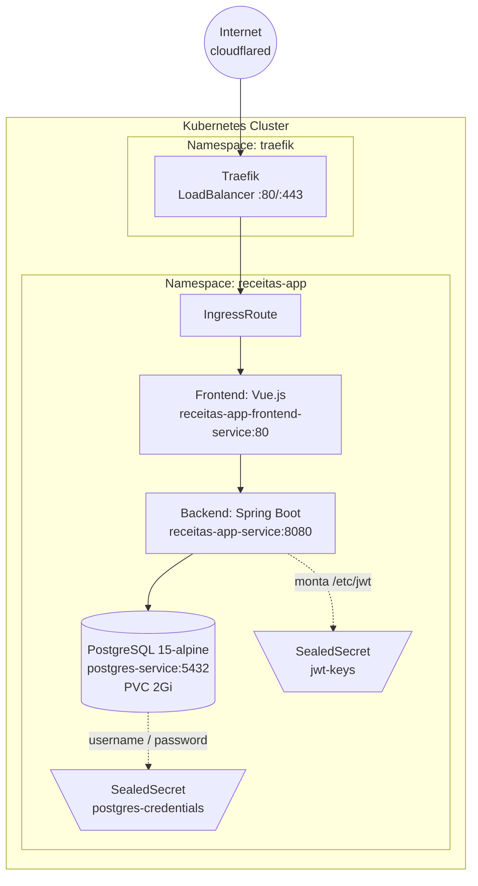

# receitas-app-infra

Repositório GitOps para o **Receitas App** — uma aplicação de receitas com frontend Vue.js + API Spring Boot + PostgreSQL, implantada em Kubernetes via ArgoCD.

## Arquitetura



## Estrutura do repositório

```
k8s/
├── app/                                ← Kustomize root: aplicação receitas-app
│   ├── kustomization.yaml              ←   Lista todos os resources
│   ├── receitas-app.yml                ←   Namespace (wave 0)
│   ├── deployment.yml                  ←   Backend Deployment + ClusterIP Service (8080)
│   ├── frontend.yml                    ←   Frontend Deployment + ClusterIP Service (80)
│   ├── ingressroute.yaml               ←   Traefik IngressRoute (catch-all → frontend)
│   ├── db/
│   │   └── postgresql.yaml             ←   PVC 2Gi + StatefulSet + ClusterIP Service (5432)
│   └── security/
│       ├── jwt-sealedsecret.yaml       ←   JWT keypair (app.key, app.pub)
│       ├── postgres-sealedsecret.yaml  ←   DB credentials (username, password)
│       └── seal-secrets.sh             ←   Script para regenerar SealedSecrets
├── traefik/                            ← Kustomize root: ingress controller Traefik
│   ├── kustomization.yaml              ←   Lista todos os resources
│   ├── namespace.yaml                  ←   Namespace traefik
│   ├── rbac.yaml                       ←   ServiceAccount + ClusterRole + Binding
│   ├── deployment.yaml                 ←   Traefik Deployment (v3.1, portas 80/443)
│   └── service.yaml                    ←   LoadBalancer Service (portas 80/443)
└── namespaces/
    └── receitas-app.yml                ← Namespace bootstrap (wave -1, fora do kustomize)
```

## Componentes

| Componente | Imagem | Porta | Service | Observações |
|---|---|---|---|---|
| Frontend | `ghcr.io/jaimecabrito01/api-receitas-frontend:latest` | 80 | `receitas-app-frontend-service` (ClusterIP) | Vue.js |
| Backend | `ghcr.io/jaimecabrito01/api-receitas-backend:latest` | 8080 | `receitas-app-service` (ClusterIP) | Spring Boot. Conecta a `postgres-service:5432/energia_db`. Monta JWT keys de `/etc/jwt`. |
| PostgreSQL | `postgres:15-alpine` | 5432 | `postgres-service` (ClusterIP) | StatefulSet + PVC 2Gi. Database: `energia_db`. |
| Traefik | `traefik:v3.1` | 80 / 443 | `traefik` (LoadBalancer) | Ingress controller. Roteia tráfego para o frontend via IngressRoute. |

## Sync-waves

| Wave | Escopo | Manifesto |
|---|---|---|
| `-1` | Bootstrap do namespace `receitas-app` | `k8s/namespaces/receitas-app.yml` |
| `0` | Aplicação + Traefik | Tudo em `k8s/app/kustomization.yaml` e `k8s/traefik/kustomization.yaml` |

> O ArgoCD gerencia `k8s/app/` e `k8s/traefik/` como **Applications separados**. Cada um tem seu próprio sync-wave 0.

## Segurança

Este repositório usa **Bitnami SealedSecrets** — nunca secrets planos versionados no git.

### Secrets gerenciados

| SealedSecret | Nome | Chaves | Uso |
|---|---|---|---|
| `jwt-sealedsecret.yaml` | `jwt-keys` | `app.key`, `app.pub` | Montado em `/etc/jwt` no backend |
| `postgres-sealedsecret.yaml` | `postgres-credentials` | `username`, `password` | Credenciais do banco `energia_db` |

### Regenerar localmente

```bash
./k8s/app/security/seal-secrets.sh
```

**Pré-requisitos:**
- `kubeseal` instalado
- Cluster com SealedSecrets controller rodando em `kube-system`

**O script:**
1. Lê `app.key` e `app.pub` de `../../../../dev/java/Api-receitas/api/src/main/resources/` (ajuste o caminho se necessário)
2. Gera `postgres-sealedsecret.yaml` com credenciais literais **`admin`/`admin123`** (apenas para dev local — trocar em produção)
3. Salva os arquivos em `k8s/app/security/`

## Fluxo de deploy (GitOps)

```
Desenvolvedor → push no Git
         ↓
GitHub Actions (externo a este repo) builda imagens → GHCR
         ↓
ArgoCD detecta drift no cluster vs. branch main
         ↓
ArgoCD sync dos Applications:
  ├── traefik (k8s/traefik/)  → namespace + RBAC + Deployment + Service
  └── receitas-app (k8s/app/) → wave -1 (namespace) → wave 0 (app + secrets + IngressRoute)
         ↓
Cluster atualizado
```

> Este repositório contém **apenas os manifests**. As imagens das aplicações são buildadas por um pipeline externo de CI/CD.

## Traefik

O ingress controller **Traefik v3.1** é deployado a partir de `k8s/traefik/kustomization.yaml` como um Application separado no ArgoCD.

- Provider: `kubernetescrd` (lê IngressRoutes, Middlewares, etc.)
- Entrypoints: `web` (:80), `websecure` (:443)
- Service tipo **LoadBalancer** expondo as portas 80 e 443
- O IngressRoute em `k8s/app/ingressroute.yaml` roteia **todo o tráfego HTTP** (catch-all) para o frontend (`receitas-app-frontend-service:80`)
- Para expor à internet, use **cloudflared** ou similar apontando para o LoadBalancer do Traefik

## Observações

- **Ajuste de caminho**: o script `seal-secrets.sh` referencia `../../../../dev/java/Api-receitas/`. Se o repositório da API estiver em outro local, atualize o `REPO_DIR` no script.
- **Dev local**: as credenciais do PostgreSQL (`admin`/`admin123`) são hardcoded no script de seal. Não usar em produção.
- **ArgoCD Applications**: `k8s/app/` e `k8s/traefik/` são dois Kustomize roots distintos. Crie um Application no ArgoCD para cada um.
