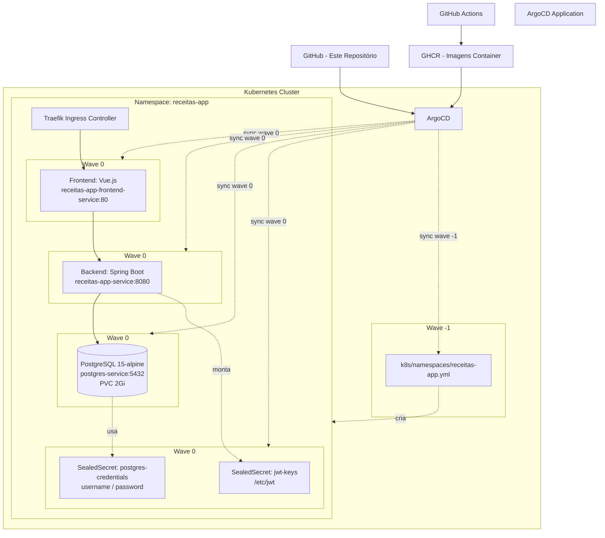

# receitas-app-infra

Repositório GitOps para o **Receitas App** — uma aplicação de receitas com frontend Vue.js + API Spring Boot + PostgreSQL, implantada em Kubernetes via ArgoCD.

## Arquitetura



## Estrutura do repositório

```
k8s/
├── app/                                ← Kustomize root (entrypoint do ArgoCD)
│   ├── kustomization.yaml              ←   Lista todos os resources
│   ├── receitas-app.yml                ←   Namespace (wave 0)
│   ├── deployment.yml                  ←   Backend Deployment + ClusterIP Service (8080)
│   ├── frontend.yml                    ←   Frontend Deployment + ClusterIP Service (80)
│   ├── db/
│   │   └── postgresql.yaml             ←   PVC 2Gi + StatefulSet + ClusterIP Service (5432)
│   └── security/
│       ├── jwt-sealedsecret.yaml       ←   JWT keypair (app.key, app.pub)
│       ├── postgres-sealedsecret.yaml  ←   DB credentials (username, password)
│       └── seal-secrets.sh             ←   Script para regenerar SealedSecrets
└── namespaces/
    └── receitas-app.yml                ← Namespace bootstrap (wave -1, fora do kustomize)
```

## Componentes

| Componente | Imagem | Porta | Service | Observações |
|---|---|---|---|---|
| Frontend | `ghcr.io/jaimecabrito01/api-receitas-frontend:latest` | 80 | `receitas-app-frontend-service` (ClusterIP) | Vue.js |
| Backend | `ghcr.io/jaimecabrito01/api-receitas-backend:latest` | 8080 | `receitas-app-service` (ClusterIP) | Spring Boot. Conecta a `postgres-service:5432/energia_db`. Monta JWT keys de `/etc/jwt`. |
| PostgreSQL | `postgres:15-alpine` | 5432 | `postgres-service` (ClusterIP) | StatefulSet + PVC 2Gi. Database: `energia_db`. |

## Sync-waves

Duas ondas de sincronização do ArgoCD para garantir ordem de criação:

| Wave | Escopo | Manifesto |
|---|---|---|
| `-1` | Bootstrap do namespace | `k8s/namespaces/receitas-app.yml` |
| `0` | Todo o resto | Tudo em `k8s/app/kustomization.yaml` |

> O manifest `k8s/app/receitas-app.yml` (também namespace, wave 0) está incluso no kustomize como redundância segura — o ArgoCD simplesmente atualiza o namespace já existente.

## Segurança

Este repositório usa **Bitnami SealedSecrets** — nunca secrets planos versionados no git.

### Secrets gerenciados

| SealedSecret | Nome | Chaves | Uso |
|---|---|---|---|
| `jwt-sealedsecret.yaml` | `jwt-keys` | `app.key`, `app.pub` | Montado em `/etc/jwt` no backend |
| `postgres-sealedsecret.yaml` | `postgres-credentials` | `username`, `password` | Credenciais do banco `energia_db` |

### Regenerar localmente

```bash
./k8s/app/security/seal-secrets.sh
```

**Pré-requisitos:**
- `kubeseal` instalado
- Cluster com SealedSecrets controller rodando em `kube-system`

**O script:**
1. Lê `app.key` e `app.pub` de `../../../../dev/java/Api-receitas/api/src/main/resources/` (ajuste o caminho se necessário)
2. Gera `postgres-sealedsecret.yaml` com credenciais literais **`admin`/`admin123`** (apenas para dev local — trocar em produção)
3. Já salva os arquivos no lugar certo (`k8s/app/security/`)

## Fluxo de deploy (GitOps)

```
Desenvolvedor → push no Git
         ↓
GitHub Actions (externo a este repo) builda imagens → GHCR
         ↓
ArgoCD detecta drift no cluster vs. branch main
         ↓
ArgoCD sync: wave -1 (namespace) → wave 0 (aplicação + secrets)
         ↓
Cluster atualizado
```

> Este repositório contém **apenas os manifests**. As imagens são buildadas por um pipeline externo de CI/CD.

## Observações

- **Ingress** ainda não configurado. O ingress controller esperado é o **Traefik**. Quando implementado, o Traefik roteará tráfego para o service do frontend.
- **Ajuste de caminho**: o script `seal-secrets.sh` referencia `../../../../dev/java/Api-receitas/`. Se o repositório da API estiver em outro local, atualize o `REPO_DIR` no script.
- **Dev local**: as credenciais do PostgreSQL (`admin`/`admin123`) são hardcoded no script de seal. Não usar em produção.
